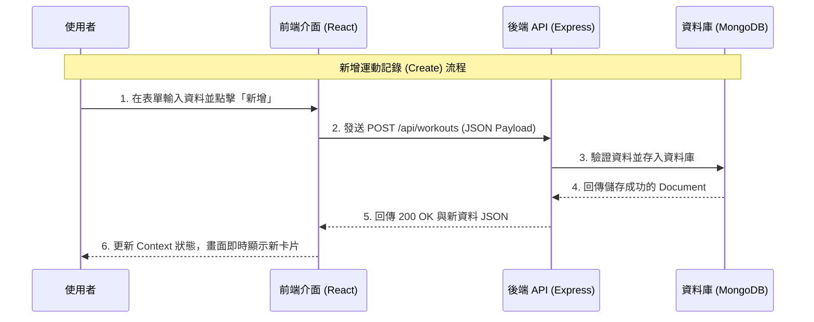

# 運動追蹤管理系統 (Sports Tracking Management System)

這是一個全端的網頁應用程式，旨在協助使用者記錄與管理日常的運動數據。透過直觀的視覺化介面，使用者可以輕鬆執行運動項目的新增、讀取、更新與刪除 (CRUD) 操作。

## 專案主題與目標
本專案的目標是建立一個現代化、響應式的運動管理平台。
- **核心功能**：完整實作 CRUD 功能，將資料持久化於後端資料庫。
- **使用者體驗**：提供即時回饋的互動介面，支援電腦與行動裝置瀏覽。

## 技術選擇原因 (Tech Stack)

本專案採用 **MERN Stack** 架構，選擇原因如下：

*   **MongoDB (Database)**: 
    -   **原因**：NoSQL 資料庫，使用 JSON 格式儲存資料，與前端 JavaScript 物件完美對應，且 Schema 設計靈活，適合快速變更需求的專案。
*   **Express.js (Backend Framework)**:
    -   **原因**：輕量級且靈活的 Node.js 框架，能快速建立 RESTful API，並擁有豐富的中介軟體 (Middleware) 生態。
*   **React (Frontend Library)**:
    -   **原因**：基於元件化 (Component-based) 開發，程式碼維護性高。透過 Virtual DOM 提供高效的渲染效能，並擁有強大的狀態管理機制。
*   **Node.js (Runtime)**:
    -   **原因**：讓前後端都能使用 JavaScript 開發，降低開發切換成本，並具備非阻塞 I/O 特性，適合處理高併發請求。

## 系統架構說明

本系統採用經典的前後端分離架構：

1.  **Frontend (Client)**: 負責使用者介面與互動，透過 HTTP Request 呼叫後端 API。
2.  **Backend (Server)**: 負責商業邏輯處理、API 路由分配與資料庫連線。
3.  **Database**: 負責資料的持久化儲存。

### 系統架構圖

```mermaid
graph TD
    User[使用者] -->|操作介面| Client[前端用戶端 (React + Vite)]
    Client -->|HTTP Requests (Axios)| Server[後端伺服器 (Node.js + Express)]
    Server -->|Mongoose ODM| DB[(MongoDB 資料庫)]
    DB -->|JSON Data| Server
    Server -->|JSON Response| Client
    Client -->|Update UI| User
```

## API 規格說明文件

後端提供 RESTful API，統一回應格式為 JSON。
**Base URL**: `http://localhost:4000/api/workouts`

| 功能 | HTTP 方法 | 路由 | 參數 (Body/Params) | 回應範例 | 說明 |
| :--- | :--- | :--- | :--- | :--- | :--- |
| **讀取所有記錄** | `GET` | `/` | 無 | `[{ "_id": "...", "title": "跑步", ... }]` | 取得依時間排序的運動列表 |
| **讀取單筆** | `GET` | `/:id` | `id` (URL Param) | `{ "_id": "...", "title": "跑步", ... }` | 取得指定 ID 的詳細資料 |
| **新增記錄** | `POST` | `/` | `{ "title": "...", "load": 10, ... }` | `{ "_id": "new_id", "title": "...", ... }` | 創建新的運動記錄 |
| **刪除記錄** | `DELETE` | `/:id` | `id` (URL Param) | `{ "_id": "deleted_id", "title": "..." }` | 刪除指定 ID 的記錄 |
| **更新記錄** | `PATCH` | `/:id` | `{ "title": "新名稱" }` | `{ "_id": "...", "title": "新名稱", ... }` | 更新指定 ID 的部分欄位 |

## CRUD 流程圖

下圖描述使用者執行「新增運動記錄」時的完整資料流：



## 安裝與執行指引

請確保您的電腦已安裝 [Node.js](https://nodejs.org/)。

### 1. 下載專案
```bash
git clone <repository-url>
cd 114_web_final_project
```

### 2. 設定後端 (Server)
```bash
cd server
npm install
# 設定環境變數 .env (預設已提供基本設定)
npm run dev
```
後端將啟動於 `http://localhost:4000`

### 3. 設定前端 (Client)
開啟新的終端機視窗：
```bash
cd client
npm install
npm run dev
```
前端將啟動於 `http://localhost:5173`

### 4. 開始使用
打開瀏覽器前往 `http://localhost:5173` 即可開始使用。
